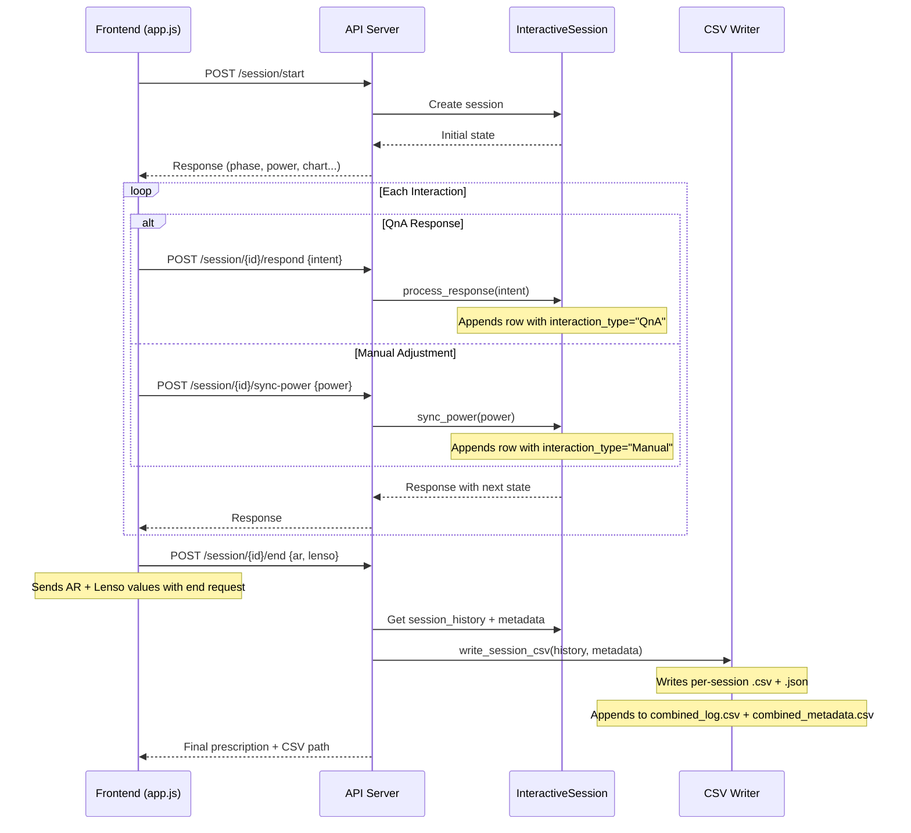

# CSV Logging Architecture for Eye Test Sessions

## Current State

The backend already maintains `session_history: List[RowContext]` in [interactive_session.py](interactive_session.py), and an **unused** `write_annotated_csv()` in [io/outputs.py](io/outputs.py). The existing `RowContext` in [core/context.py](core/context.py) captures most per-row fields but is missing `Manual_or_QnA_Driven` and `Change_Delta`. AR/Lenso values are only tracked in the frontend (`storedPower` in [frontend/app.js](frontend/app.js)).

---

## Tier 1: Per-Row CSV (the main event log)

One row is appended to `session_history` on every interaction. At session end, the full history is written to CSV.

### Columns (in order)

- **1 - `Row_Number`**: Auto-increment. Sequence within session (1-based).
- **2 - `Timestamp`**: Backend `datetime.now()`. ISO 8601 format: `2026-02-26T14:30:05.123`.
- **3 - `Manual_or_QnA`**: New field on RowContext. `"QnA"` when from `process_response()`, `"Manual"` when from `sync_power()`.
- **4 - `R_SPH`**: `current_row.r_sph`. Already tracked.
- **5 - `R_CYL`**: `current_row.r_cyl`. Already tracked.
- **6 - `R_AXIS`**: `current_row.r_axis`. Already tracked.
- **7 - `R_ADD`**: `add_right`. Already tracked.
- **8 - `L_SPH`**: `current_row.l_sph`. Already tracked.
- **9 - `L_CYL`**: `current_row.l_cyl`. Already tracked.
- **10 - `L_AXIS`**: `current_row.l_axis`. Already tracked.
- **11 - `L_ADD`**: `add_left`. Already tracked.
- **12 - `Occluder_State`**: `current_row.occluder_state`. e.g., `BINO`, `Left_Occluded`, `Right_Axis_Flip1`.
- **13 - `Chart_Number`**: `current_row.chart_number`. Already tracked.
- **14 - `Chart_Display`**: `current_row.chart_display`. e.g., `echart_400`, `jcc_chart`, `duochrome`.
- **15 - `Change_Delta`**: **New** computed diff. Human-readable text mirroring Test History (see below).
- **16 - `Current_Phase`**: `phase_names[current_phase]`. e.g., `Phase E: JCC Axis Right (Step 6.2)`.

### How `Change_Delta` is computed

Computed in the backend by diffing the current row against the previous row in `session_history`:

- Row 1: `"Test started"`
- QnA row: `"Response: <intent>"` -- e.g., `"Response: Better"`, `"Response: Flip 1"`
- Manual row: `"Manual Adjust: SPH +0.25 [R]"` -- mirrors what `addToHistory` currently generates in the frontend
- Chart switch: `"Switched to chart 3"`
- Phase jump: `"Jumped to Phase E: JCC Axis Right"`
- Auto-flip: `"Flip 2 displayed"`
- Last row: `"Test completed"`

This keeps it consistent with what the frontend Test History panel already shows.

### Additional columns recommended for ML evaluation

- **17 - `Phase_ID`**: Machine-readable phase key (e.g., `jcc_axis_right`). Essential for programmatic filtering/grouping during ML eval.
- **18 - `Optometrist_Question`**: The question displayed to the patient. Captures the model's "output".
- **19 - `Patient_Answer_Intent`**: The intent button pressed. Captures the patient's "input" to the model.

These 3 already exist in `RowContext` (question/intent are partially populated; phase_id is derived). They are critical for an ML evaluation framework because they let you answer: "Given this question in this phase, what did the patient answer, and what power change did the model make?"

Note: `Eye_Tested` was removed as it is fully derivable from `Occluder_State` (e.g., `Left_Occluded` = right eye tested, `BINO` = both, etc.).

---

## Tier 2: Session-Level Metadata (JSON)

One JSON file per session, written alongside the CSV at session end.

### Structure

```json
{
  "session_id": "session_1740567890123",
  "phoropter_id": "phoropter-1",
  "session_start_time": "2026-02-26T14:30:00.000",
  "session_end_time": "2026-02-26T14:45:32.456",
  "session_duration_seconds": 932,
  "test_completion_status": "completed | aborted | jumped",
  "total_interactions": 47,

  "ar": {
    "right": { "sph": -2.00, "cyl": -0.75, "axis": 170 },
    "left": { "sph": -1.75, "cyl": -0.50, "axis": 10 }
  },
  "lensometry": {
    "right": { "sph": -1.75, "cyl": -0.50, "axis": 175 },
    "left": { "sph": -1.50, "cyl": -0.25, "axis": 5 }
  },
  "final_prescription": {
    "right": { "sph": -2.25, "cyl": -0.75, "axis": 172, "add": 0.0 },
    "left": { "sph": -2.00, "cyl": -0.50, "axis": 8, "add": 0.0 }
  },

  "phases_completed": ["distance_vision", "right_eye_refraction", "..."],
  "phases_skipped": [],

  "quality_metrics": {
    "manual_adjustment_count": 3,
    "qna_interaction_count": 44,
    "phase_jump_count": 0,
    "jcc_cycles_right": 2,
    "jcc_cycles_left": 3,
    "unable_to_read_count": 1,
    "duration_per_phase": {
      "distance_vision": 45,
      "right_eye_refraction": 120,
      "...": "..."
    }
  }
}
```

### What to store at metadata level (beyond AR, Lenso, Final)

Strongly recommended additional metadata fields:

- **`test_completion_status`**: Did the test complete naturally, get aborted early (user clicked "End Test"), or involve phase jumps? Critical for filtering valid vs. invalid sessions in ML training.
- **`phases_completed` / `phases_skipped`**: Which phases actually ran. If someone jumped from Phase B to Phase K, the CSV rows will show this, but having it in metadata lets you quickly filter sessions by completeness.
- **`quality_metrics`**: Aggregated counts (manual adjustments, QnA interactions, JCC cycles, unable-to-read counts, phase jumps). These are signals for session quality -- an ML eval framework needs to separate "clean" sessions from noisy ones.
- **`duration_per_phase`**: Time spent in each phase. Useful for identifying phases where the model struggles (longer = more iterations needed).
- **`delta_ar_to_final`**: The difference between AR input and final prescription. This is the core metric for evaluating refraction accuracy. Example: `AR R_SPH = -2.00, Final R_SPH = -2.25, delta = -0.25`.
- **`delta_lenso_to_final`**: Same but vs. lensometry. Tells you how much the new Rx changed from the patient's current glasses.
- **`model_version` / `brain_id`** (future): When the ML model evolves, you need to tag which version generated each session. Not in the codebase yet but worth adding the field now.
- **`operator_id`** (future): Which optometrist ran the test. Important for inter-rater reliability analysis.

---

## File Structure

```
eye_test_engine/
  logs/
    sessions/
      session_<id>.csv              # Per-session row-level CSV
      session_<id>_metadata.json    # Per-session metadata
    combined_log.csv                # All sessions appended (growing file)
    combined_metadata.csv           # One row per session (growing file)
```

- **Per-session files**: For debugging individual sessions, replaying tests, clinical audit
- **Combined files**: For ML evaluation across sessions, analytics, pattern analysis

The `combined_metadata.csv` flattens the JSON into columns: `session_id, phoropter_id, start_time, ..., ar_r_sph, ar_r_cyl, ..., final_r_sph, ..., manual_count, qna_count, ...`

---

## Data Flow



Key design decision: **AR and Lenso values are sent from frontend to backend at session end** (in the `/end` request body). This avoids adding new endpoints and ensures the metadata captures whatever was entered during the session.

---

## Implementation Changes

### Backend changes:

- **[core/context.py](core/context.py)**: Add `interaction_type` and `change_delta` fields to `RowContext`
- **[interactive_session.py](interactive_session.py)**:
  - Tag each row with `interaction_type` ("QnA" in `process_response()`, "Manual" in `sync_power()`)
  - Compute `change_delta` text when appending to `session_history`
  - Populate `optometrist_question` and `phase_id`/`phase_name` on each row
  - Track `session_start_time` and phase timestamps
- **[api_server.py](api_server.py)**:
  - Accept `ar` and `lenso` in the `/end` request body
  - Call CSV writer at session end
- **[io/outputs.py](io/outputs.py)**:
  - Rewrite `write_annotated_csv()` with the new 19-column schema
  - Add `write_session_metadata()` for JSON output
  - Add `append_to_combined_log()` for the growing CSV
  - Add `append_to_combined_metadata()` for the growing metadata CSV

### Frontend changes:

- **[frontend/app.js](frontend/app.js)**:
  - Send `storedPower.ar` and `storedPower.lenso` in the `completeTest()` fetch body to `/end`
  - No other frontend changes needed (all logging happens in backend)
