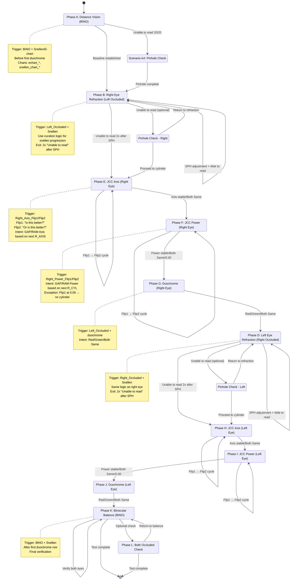

# Eye Test State Machine Diagram

This document describes the state machine for the end-to-end eye test algorithm, showing phase transitions and decision points.

---

## State Machine Flow



---

## Phase Transition Rules

### **A → B: Distance Vision to Right Eye Refraction**
- **Condition:** Baseline distance VA established with BINO
- **Optional detour:** A4 Pinhole if unable to read 20/20

### **B → E: Right Eye Refraction to JCC Axis**
- **Condition:** "Unable to read" appears **twice** after SPH adjustments
- **Interpretation:** Spherical power refined; cylinder error present

### **E → F: JCC Axis to JCC Power**
- **Condition:** Axis stable (Both Same) or refinement complete
- **Cycles:** Multiple Flip1→Flip2 pairs until stable

### **F → G: JCC Power to Duochrome**
- **Condition:** Power stable, Both Same, or 0.00 (no cylinder)
- **Exception:** Flip1 at 0.00 → skip power refinement

### **G → D: Duochrome Right to Left Eye Refraction**
- **Condition:** Red/Green/Both Same response received
- **Transition:** Switch to left eye testing

### **D → H: Left Eye Refraction to JCC Axis**
- **Condition:** Same as B→E (2x "Unable to read" after SPH)

### **H → I: JCC Axis to JCC Power (Left)**
- **Condition:** Same as E→F

### **I → J: JCC Power to Duochrome (Left)**
- **Condition:** Same as F→G

### **J → K: Duochrome Left to Binocular Balance**
- **Condition:** Both eyes refined; proceed to balance check
- **Trigger change:** BINO + Snellen after duochrome

### **K → End: Binocular Balance to Complete**
- **Condition:** Final verification complete
- **Optional:** Both_Occluded check before end

---

## Decision Points

### **Decision Point 1: Pinhole Check Trigger**
```
IF (BINO + snellen_chart_20_20_20) AND (Intent = "Unable to read")
THEN → Trigger Pinhole Check (A4)
ELSE → Continue Distance Vision
```

### **Decision Point 2: Move to Cylinder (Right Eye)**
```
count_unable = 0
FOR each row in Right Eye Refraction:
    IF (SPH changed from previous) AND (Intent = "Unable to read"):
        count_unable += 1
    IF count_unable >= 2:
        → Proceed to JCC Axis (Phase E)
```

### **Decision Point 3: JCC Power Exception (0.00 cylinder)**
```
IF (Power_Flip1) AND (current R_CYL = 0.00) AND (Flip1 chosen):
    Intent = "Both Same (no cylinder power)"
    → Skip power refinement, proceed to Duochrome
```

### **Decision Point 4: Move to Cylinder (Left Eye)**
```
Same logic as Decision Point 2, using L_SPH and Left Eye rows
```

### **Decision Point 5: Binocular Balance Trigger**
```
IF (first duochrome row encountered):
    mark_duochrome_seen = True
IF (BINO + Snellen) AND (mark_duochrome_seen = True):
    → Phase K: Binocular Balance
ELSE:
    → Phase A: Distance Vision
```

---

## Separate Phase Markers (Non-sequential)

### **Pinhole Check (Phase C)**
- **Trigger:** `Right_Pinhole` or `Left_Pinhole` at any point
- **Does not interrupt main flow:** Labeled separately
- **Returns to:** Previous refraction phase or proceeds to next

### **Both Occluded (Phase L)**
- **Trigger:** `Both_Occluded` at any point
- **Typically appears:** During or after Binocular Balance
- **Purpose:** Additional verification

### **Detection Failed (Phase M)**
- **Trigger:** `Detection_Failed` at any point
- **Purpose:** QA marker; excluded from phase scoring
- **Action:** Log and continue to next valid row

---

## State Variables Tracked

```python
state_variables = {
    "current_phase": str,              # A, B, C, D, E, F, G, H, I, J, K, L, M
    "current_eye": str,                # "right", "left", "both"
    "duochrome_seen": bool,            # False until first duochrome
    "right_sph_stable": bool,          # True after 2x "Unable to read"
    "left_sph_stable": bool,           # True after 2x "Unable to read"
    "right_axis_stable": bool,         # True after "Both Same" in axis
    "left_axis_stable": bool,          # True after "Both Same" in axis
    "right_cyl_stable": bool,          # True after "Both Same" or 0.00
    "left_cyl_stable": bool,           # True after "Both Same" or 0.00
    "unable_read_count_right": int,    # Count for right eye SPH exit
    "unable_read_count_left": int,     # Count for left eye SPH exit
    "last_question": str,              # For confidence detection
    "last_occluder": str,              # For confidence detection
}
```

---

## Example Trace (Simplified)

```
Row 1:  BINO + echart_400           → Phase A (Distance Vision)
Row 5:  BINO + snellen_20_20_20     → Phase A (Distance Vision)
Row 10: Left_Occluded + snellen     → Phase B (Right Eye Refraction)
Row 15: Left_Occluded + snellen     → Phase B (SPH change, "Unable to read" count=1)
Row 20: Left_Occluded + snellen     → Phase B (SPH change, "Unable to read" count=2)
Row 21: Right_Axis_Flip1 + jcc      → Phase E (JCC Axis Right, Flip1)
Row 22: Right_Axis_Flip2 + jcc      → Phase E (JCC Axis Right, Flip2 → GAP Axis)
Row 25: Right_Power_Flip1 + jcc     → Phase F (JCC Power Right, Flip1)
Row 26: Right_Power_Flip2 + jcc     → Phase F (JCC Power Right, Flip2 → RAM Power)
Row 30: Left_Occluded + duochrome   → Phase G (Duochrome Right) [duochrome_seen=True]
Row 35: Right_Occluded + snellen    → Phase D (Left Eye Refraction)
Row 45: Left_Axis_Flip1 + jcc       → Phase H (JCC Axis Left)
Row 50: Left_Power_Flip1 + jcc      → Phase I (JCC Power Left)
Row 55: Right_Occluded + duochrome  → Phase J (Duochrome Left)
Row 60: BINO + snellen              → Phase K (Binocular Balance)
Row 70: BINO + snellen              → Phase K (Binocular Balance, final)
```

---

## Notes

- **Phases are sequential** for the main flow (A→B→E→F→G→D→H→I→J→K).
- **Pinhole, Both Occluded, Detection Failed** are separate markers that can appear at any point.
- **Decision points** use intent labels and machine state changes to determine transitions.
- **State variables** persist across rows to track progress and trigger phase changes.

---

## Refined Granular Algorithm (Phase-by-Phase with Scenarios)

### Phase A — Distance Vision (Step 2.1)

**Trigger:** BINO + Snellen/E-chart before first duochrome row

#### Scenarios:

**A1: E-chart baseline**
- **Row:** BINO + echart_400
- **Question:** "Are you able to see big E clearly."
- **Intent:** "Able to read" / "Blurry" / "Unable to read"

**A2: Snellen baseline**
- **Row:** BINO + snellen_chart_20_20_20
- **Question:** "Please read the line you can see clearly."
- **Intent:** "Able to read" / "Blurry" / "Unable to read"

**A3: Snellen progression (finer lines)**
- **Row:** BINO + snellen_chart_40_30_25_40 → snellen_chart_40_30_25_25
- **Logic:** Use curation logic to detect if highlight decreases (finer line)
- **Intent:** "Able to read" (if progressing to finer) / "Unable to read" (if regressing)

**A4: Pinhole check (if unable to read 20/20)**
- **Row:** Right_Pinhole or Left_Pinhole + Snellen
- **Question:** "Please read the line you can see clearly."
- **Intent:** "Able to read" / "Unable to read"
- **Trigger:** Patient marked "Unable to read" on snellen_chart_20_20_20 in BINO

---

### Phase B — Right Eye Refraction (RE6.3)

**Trigger:** Left_Occluded + Snellen/E-chart

#### Scenarios:

**B1: Initial right-eye snellen**
- **Row:** Left_Occluded + snellen_chart_20_20_20
- **Question:** "I'm covering your left eye. Please read the line you can see clearly."
- **Intent:** "Able to read" / "Blurry" / "Unable to read"

**B2: Sphere refinement (SPH change)**
- **Row sequence:** R_SPH: 0.0 → -0.5 → -1.0 with same snellen base
- **Logic:** Track SPH changes; if "Unable to read" appears twice after SPH increase, mark sphere as refined and move to cylinder (JCC)
- **Intent:** "Getting better" (if SPH change improves) / "Unable to read" (if no improvement after 2 attempts)

**B3: Snellen line progression**
- **Row:** snellen_chart_40_30_25_40 → snellen_chart_40_30_25_25
- **Logic:** Use curation logic (highlight comparison, cross-base lookahead)
- **Intent:** "Able to read" / "Unable to read"

**Exit condition:** Two consecutive "Unable to read" after SPH adjustments → proceed to Phase E (JCC Axis)

---

### Phase C — Pinhole Check (Separate)

**Trigger:** Right_Pinhole or Left_Pinhole

#### Scenario C1:
- **Row:** Right_Pinhole + Snellen
- **Question:** "Please read the line you can see clearly."
- **Intent:** "Able to read" / "Unable to read"

---

### Phase D — Left Eye Refraction (LE6.3)

**Trigger:** Right_Occluded + Snellen/E-chart

#### Scenarios:

**D1: Initial left-eye snellen**
- **Row:** Right_Occluded + snellen_chart_20_20_20
- **Question:** "I'm covering your right eye. Please read the line you can see clearly."
- **Intent:** "Able to read" / "Blurry" / "Unable to read"

**D2: Sphere refinement (SPH change)**
- **Row sequence:** L_SPH: 0.0 → -0.5 → -1.0
- **Logic:** Same as Phase B; two "Unable to read" after SPH → move to cylinder
- **Intent:** "Getting better" / "Unable to read"

**Exit condition:** Two consecutive "Unable to read" after SPH adjustments → proceed to Phase H (JCC Axis)

---

### Phase E — JCC Axis (Right Eye)

**Trigger:** Right_Axis_Flip1 / Right_Axis_Flip2 + jcc_chart

#### Scenarios:

**E1: Flip1 presentation**
- **Row:** Right_Axis_Flip1 + jcc_chart
- **Question:** "Focus on the dot chart. Is this better? (Flip 1)"
- **Intent:** "No response expected (Flip 1 presented, awaiting Flip 2 comparison)"

**E2: Flip2 — patient chooses Flip 1 (GAP Axis)**
- **Row:** Right_Axis_Flip2
- **Question:** "Or is this better? (Flip 2)"
- **Next row shows:** R_AXIS increased by ~5°
- **Intent:** "Flip 1: GAP Axis (patient chose Flip 1, increase axis by 5°)"

**E3: Flip2 — patient chooses Flip 2 (RAM Axis)**
- **Next row shows:** R_AXIS decreased by ~5°
- **Intent:** "Flip 2: RAM Axis (patient chose Flip 2, decrease axis by 5°)"

**E4: Flip2 — Both Same**
- **Next row shows:** R_AXIS unchanged
- **Intent:** "Both Same (no change needed)"

**Exit condition:** Axis refinement complete (no change or stable) → proceed to Phase F

---

### Phase F — JCC Power (Right Eye)

**Trigger:** Right_Power_Flip1 / Right_Power_Flip2 + jcc_chart

#### Scenarios:

**F1: Flip1 presentation**
- **Row:** Right_Power_Flip1
- **Question:** "Focus on the dot chart. Is this better? (Flip 1)"
- **Intent:** "No response expected"

**F2: Flip2 — patient chooses Flip 1 (GAP Power)**
- **Row:** Right_Power_Flip2
- **Next row shows:** R_CYL increased by ~0.25D (e.g., -1.0 → -0.75)
- **Intent:** "Flip 1: GAP Power (patient chose Flip 1, increase cylinder by 0.25D)"

**F3: Flip2 — patient chooses Flip 2 (RAM Power)**
- **Next row shows:** R_CYL decreased by ~0.25D (e.g., -1.0 → -1.25)
- **Intent:** "Flip 2: RAM Power (patient chose Flip 2, decrease cylinder by 0.25D)"

**F4: Flip2 — Both Same / No cylinder**
- **Next row shows:** R_CYL unchanged or remains 0.00
- **Intent:** "Both Same (no change needed)"

**Exception:** If current R_CYL = 0.00 and Flip 1 chosen → "Both Same" (no cylinder power needed)

**Exit condition:** Power refinement complete → proceed to Phase G

---

### Phase G — Duochrome (Right Eye)

**Trigger:** Left_Occluded + duochrome

#### Scenario G1:
- **Row:** Left_Occluded + duochrome
- **Question:** "Which is clearer: red or green, or are they the same?"
- **Intent:** "Red" / "Green" / "Both Same"

---

### Phase H — JCC Axis (Left Eye)

**Trigger:** Left_Axis_Flip1 / Left_Axis_Flip2 + jcc_chart

#### Scenarios: Same as Phase E, but using L_AXIS

**H1: Flip1**
- **Intent:** "No response expected"

**H2: Flip2 — GAP Axis**
- **Next row shows:** L_AXIS increases

**H3: Flip2 — RAM Axis**
- **Next row shows:** L_AXIS decreases

**H4: Flip2 — Both Same**
- **Next row shows:** L_AXIS unchanged

---

### Phase I — JCC Power (Left Eye)

**Trigger:** Left_Power_Flip1 / Left_Power_Flip2 + jcc_chart

#### Scenarios: Same as Phase F, but using L_CYL

**I1: Flip1**
- **Intent:** "No response expected"

**I2: Flip2 — GAP Power**
- **Next row shows:** L_CYL increases

**I3: Flip2 — RAM Power**
- **Next row shows:** L_CYL decreases

**I4: Flip2 — Both Same**
- **Next row shows:** L_CYL unchanged or 0.00

---

### Phase J — Duochrome (Left Eye)

**Trigger:** Right_Occluded + duochrome

#### Scenario J1:
- **Row:** Right_Occluded + duochrome
- **Question:** "Which is clearer: red or green, or are they the same?"
- **Intent:** "Red" / "Green" / "Both Same"

---

### Phase K — Binocular Balance (Step 6.5)

**Trigger:** BINO + Snellen/E-chart after first duochrome row

#### Scenario K1:
- **Row:** BINO + snellen_chart_20_20_20
- **Question:** "Please read the line you can see clearly."
- **Intent:** "Able to read" / "Blurry" / "Unable to read"

---

### Phase L — Both Occluded (Separate)

**Trigger:** Both_Occluded + Snellen

#### Scenario L1:
- **Row:** Both_Occluded + snellen_chart_20_20_20
- **Question:** "Please read the line you can see clearly."
- **Intent:** "Able to read" / "Unable to read"

---

### Phase M — Detection Failed (Separate)

**Trigger:** Detection_Failed

#### Scenario M1:
- **Row:** Detection_Failed + any chart
- **Question:** "Please describe what you see."
- **Intent:** "Responds to instruction."

---

File created: [STATE_MACHINE_DIAGRAM.md](STATE_MACHINE_DIAGRAM.md)
