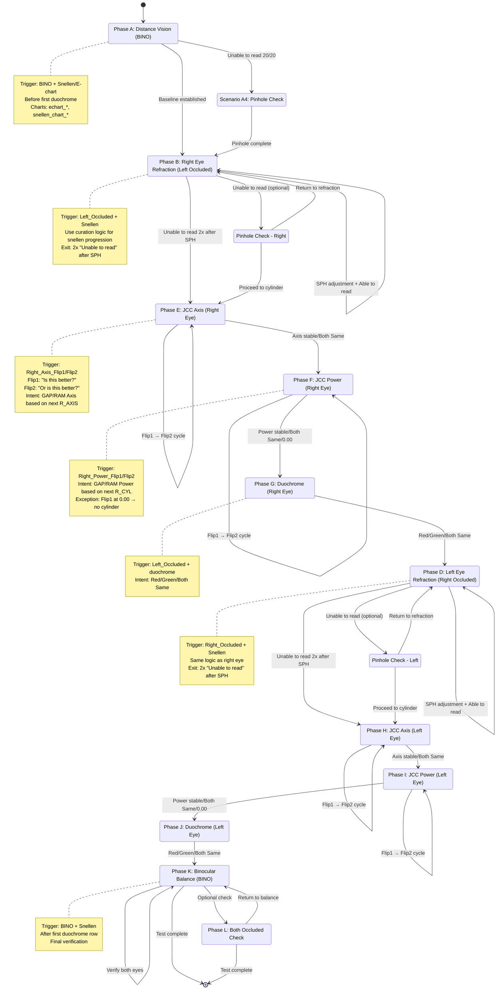

# Eye Test State Machine Diagram

This document describes the state machine for the end-to-end eye test algorithm, showing phase transitions and decision points.

---

## State Machine Flow



---

## Phase Transition Rules

### **A → B: Distance Vision to Right Eye Refraction**
- **Condition:** Baseline distance VA established with BINO
- **Optional detour:** A4 Pinhole if unable to read 20/20

### **B → E: Right Eye Refraction to JCC Axis**
- **Condition:** "Unable to read" appears **twice** after SPH adjustments
- **Interpretation:** Spherical power refined; cylinder error present

### **E → F: JCC Axis to JCC Power**
- **Condition:** Axis stable (Both Same) or refinement complete
- **Cycles:** Multiple Flip1→Flip2 pairs until stable

### **F → G: JCC Power to Duochrome**
- **Condition:** Power stable, Both Same, or 0.00 (no cylinder)
- **Exception:** Flip1 at 0.00 → skip power refinement

### **G → D: Duochrome Right to Left Eye Refraction**
- **Condition:** Red/Green/Both Same response received
- **Transition:** Switch to left eye testing

### **D → H: Left Eye Refraction to JCC Axis**
- **Condition:** Same as B→E (2x "Unable to read" after SPH)

### **H → I: JCC Axis to JCC Power (Left)**
- **Condition:** Same as E→F

### **I → J: JCC Power to Duochrome (Left)**
- **Condition:** Same as F→G

### **J → K: Duochrome Left to Binocular Balance**
- **Condition:** Both eyes refined; proceed to balance check
- **Trigger change:** BINO + Snellen after duochrome

### **K → End: Binocular Balance to Complete**
- **Condition:** Final verification complete
- **Optional:** Both_Occluded check before end

---

## Decision Points

### **Decision Point 1: Pinhole Check Trigger**
```
IF (BINO + snellen_chart_20_20_20) AND (Intent = "Unable to read")
THEN → Trigger Pinhole Check (A4)
ELSE → Continue Distance Vision
```

### **Decision Point 2: Move to Cylinder (Right Eye)**
```
count_unable = 0
FOR each row in Right Eye Refraction:
    IF (SPH changed from previous) AND (Intent = "Unable to read"):
        count_unable += 1
    IF count_unable >= 2:
        → Proceed to JCC Axis (Phase E)
```

### **Decision Point 3: JCC Power Exception (0.00 cylinder)**
```
IF (Power_Flip1) AND (current R_CYL = 0.00) AND (Flip1 chosen):
    Intent = "Both Same (no cylinder power)"
    → Skip power refinement, proceed to Duochrome
```

### **Decision Point 4: Move to Cylinder (Left Eye)**
```
Same logic as Decision Point 2, using L_SPH and Left Eye rows
```

### **Decision Point 5: Binocular Balance Trigger**
```
IF (first duochrome row encountered):
    mark_duochrome_seen = True
IF (BINO + Snellen) AND (mark_duochrome_seen = True):
    → Phase K: Binocular Balance
ELSE:
    → Phase A: Distance Vision
```

---

## Separate Phase Markers (Non-sequential)

### **Pinhole Check (Phase C)**
- **Trigger:** `Right_Pinhole` or `Left_Pinhole` at any point
- **Does not interrupt main flow:** Labeled separately
- **Returns to:** Previous refraction phase or proceeds to next

### **Both Occluded (Phase L)**
- **Trigger:** `Both_Occluded` at any point
- **Typically appears:** During or after Binocular Balance
- **Purpose:** Additional verification

### **Detection Failed (Phase M)**
- **Trigger:** `Detection_Failed` at any point
- **Purpose:** QA marker; excluded from phase scoring
- **Action:** Log and continue to next valid row

---

## State Variables Tracked

```python
state_variables = {
    "current_phase": str,              # A, B, C, D, E, F, G, H, I, J, K, L, M
    "current_eye": str,                # "right", "left", "both"
    "duochrome_seen": bool,            # False until first duochrome
    "right_sph_stable": bool,          # True after 2x "Unable to read"
    "left_sph_stable": bool,           # True after 2x "Unable to read"
    "right_axis_stable": bool,         # True after "Both Same" in axis
    "left_axis_stable": bool,          # True after "Both Same" in axis
    "right_cyl_stable": bool,          # True after "Both Same" or 0.00
    "left_cyl_stable": bool,           # True after "Both Same" or 0.00
    "unable_read_count_right": int,    # Count for right eye SPH exit
    "unable_read_count_left": int,     # Count for left eye SPH exit
    "last_question": str,              # For confidence detection
    "last_occluder": str,              # For confidence detection
}
```

---

## Example Trace (Simplified)

```
Row 1:  BINO + echart_400           → Phase A (Distance Vision)
Row 5:  BINO + snellen_20_20_20     → Phase A (Distance Vision)
Row 10: Left_Occluded + snellen     → Phase B (Right Eye Refraction)
Row 15: Left_Occluded + snellen     → Phase B (SPH change, "Unable to read" count=1)
Row 20: Left_Occluded + snellen     → Phase B (SPH change, "Unable to read" count=2)
Row 21: Right_Axis_Flip1 + jcc      → Phase E (JCC Axis Right, Flip1)
Row 22: Right_Axis_Flip2 + jcc      → Phase E (JCC Axis Right, Flip2 → GAP Axis)
Row 25: Right_Power_Flip1 + jcc     → Phase F (JCC Power Right, Flip1)
Row 26: Right_Power_Flip2 + jcc     → Phase F (JCC Power Right, Flip2 → RAM Power)
Row 30: Left_Occluded + duochrome   → Phase G (Duochrome Right) [duochrome_seen=True]
Row 35: Right_Occluded + snellen    → Phase D (Left Eye Refraction)
Row 45: Left_Axis_Flip1 + jcc       → Phase H (JCC Axis Left)
Row 50: Left_Power_Flip1 + jcc      → Phase I (JCC Power Left)
Row 55: Right_Occluded + duochrome  → Phase J (Duochrome Left)
Row 60: BINO + snellen              → Phase K (Binocular Balance)
Row 70: BINO + snellen              → Phase K (Binocular Balance, final)
```

---

## Notes

- **Phases are sequential** for the main flow (A→B→E→F→G→D→H→I→J→K).
- **Pinhole, Both Occluded, Detection Failed** are separate markers that can appear at any point.
- **Decision points** use intent labels and machine state changes to determine transitions.
- **State variables** persist across rows to track progress and trigger phase changes.

---

File created: [STATE_MACHINE_DIAGRAM.md](STATE_MACHINE_DIAGRAM.md)
